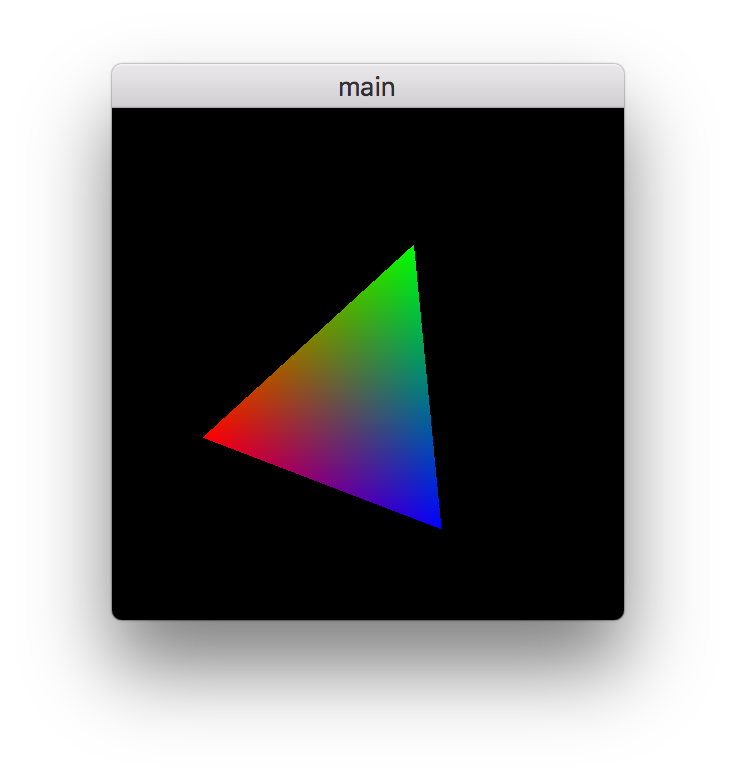

# Metal Programming without Xcode
A simple example of Metal written in Objective-C++ which can be compiled in command-line.

## How to pre-compile Metal shaders
### Export PATH for Metal compiler
	export PATH="$PATH:/Applications/Xcode.app/Contents/Developer/Platforms/MacOSX.platform/usr/bin

or

	echo 'export PATH="$PATH:/Applications/Xcode.app/Contents/Developer/Platforms/MacOSX.platform/usr/bin"' >> ~/.bashrc

### Compile
Just run the following command:

	make shaders.metallib

or, if you want to do it manually:
#### Compile .metal file into .air
	metal -std=osx-metal1.1 -o shaders.air shaders.metal

#### Archive .air into .metal-ar
	metal-ar r shaders.metal-ar shaders.air

#### Make .metallib from metal-ar
	metallib -o shaders.metallib shaders.metal-ar
